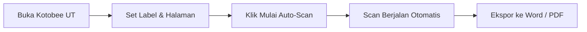

# 📖 UT Book Scanner

<p align="center">
  
</p>

<p align="center">
  <b>Automated High-Resolution Page Capture & Document Exporter for Universitas Terbuka (Kotobee Reader)</b><br>
  <sub>Dirancang & Dikembangkan oleh <b>Adjie Kurniawan</b></sub>
</p>

<p align="center">
  <a href="https://github.com/masadjie/ut-learning-book/releases/tag/v1.0.0"></a>
  
  
  <a href="LICENSE"></a>
</p>

---

## 📌 Sekilas Tentang Proyek

Membaca modul digital pada platform Ruang Baca Virtual (RBV) Universitas Terbuka yang berbasis **Kotobee Reader** sering kali membutuhkan akses dokumen offline untuk kebutuhan belajar mandiri, merangkum materi kuliah, atau membuat arsip rujukan tugas.

**UT Book Scanner** adalah ekstensi browser Google Chrome (*Manifest V3*) modern yang mengotomatisasi proses pengarsipan halaman modul digital secara presisi, beresolusi tinggi, dan siap diekspor langsung ke format **Microsoft Word (.docx A4 Landscape)** serta **PDF (Print Layout Ready)** dalam hitungan detik.

---

## ✨ Fitur Unggulan

| Fitur | Deskripsi |
| :--- | :--- |
| 🚀 **Auto-Scan & Smart Page Detection** | Menangkap halaman aktif secara otomatis dan berpindah ke halaman berikutnya dengan simulasi navigasi multi-event cerdas. |
| 🎯 **Fleksibilitas Batas Halaman** | Pilihan kuota instan (5, 10, 15, 25, 50, Semua) atau **Input Kustom** untuk menentukan jumlah halaman manual sesuai kebutuhan. |
| 🏷️ **Custom File & Title Labeling** | Berikan judul modul kustom yang otomatis disematkan ke sampul dokumen dan nama file unduhan. |
| 📄 **Word (.docx) Landscape HD** | Dokumen Word OpenXML murni berorientasi *A4 Landscape*, menjaga proporsi materi tanpa terpotong atau blur. |
| 📑 **Direct Save / Print PDF** | Sekali klik untuk membuka layout cetak siap simpan ke format PDF di browser. |
| 🎨 **Floating Transparent Widget** | Widget kontrol melayang yang *draggable*, dapat di-minimize menjadi ikon badge transparan yang tidak mengganggu area baca. |
| ⚡ **Zero-Lag & Anti-Duplikasi** | Dilengkapi algoritma multi-chunk hash signature untuk memastikan setiap halaman tersimpan akurat tanpa duplikasi. |

---

## 🚀 Panduan Instalasi Cepat

Ekstensi ini dapat dipasang secara langsung di Google Chrome (*atau browser berbasis Chromium seperti Edge, Brave, Opera*):

1. **Unduh / Clone Repositori:**
   ```bash
   git clone https://github.com/masadjie/ut-learning-book.git
   ```
   *(Atau unduh file ZIP melalui menu **Code -> Download ZIP** lalu ekstrak ke komputer Anda)*.

2. **Buka Menu Ekstensi Chrome:**
   Ketik alamat berikut di address bar browser Anda:
   ```text
   chrome://extensions
   ```

3. **Aktifkan Developer Mode:**
   Nyalakan sakelar **Developer mode** di pojok kanan atas halaman ekstensi.

4. **Muat Ekstensi:**
   Klik tombol **Load unpacked** (*Muat yang belum dibongkar*) di sudut kiri atas, lalu pilih direktori folder `ut-learning-book`.

5. **Selesai!** Ekstensi telah terpasang dan siap digunakan. 🎉

---

## 📖 Cara Penggunaan



1. Buka buku atau modul yang ingin dipelajari di [Kotobee Reader UT](https://univterbuka.kotobee.com/).
2. Arahkan ke halaman awal materi yang diinginkan (misal: *Modul 1*).
3. Widget kontrol **UT Book Scanner** akan otomatis muncul di sudut kanan bawah layar buku.
4. Isi **🏷️ Nama Label / Judul File** (contoh: `ISIP4211 - Logika Modul 1`).
5. Pilih **🎯 Batas Halaman** yang diinginkan (*atau pilih manual untuk memasukkan angka halaman kustom*).
6. Klik **▶️ Mulai Auto-Scan**. Ekstensi akan memindai halaman demi halaman secara otomatis.
7. Setelah selesai, klik tombol:
   - **📄 Word (.docx)** untuk mengunduh dokumen Microsoft Word Landscape.
   - **📑 Cetak / PDF** untuk membuka jendela cetak / simpan sebagai PDF.

---

## 📂 Struktur File & Arsitektur

```text
ut-learning-book/
├── manifest.json            # Spesifikasi Manifest V3 & deklarasi permission
├── icons/                   # Aset ikon resolusi 16px, 48px, 128px & badge logo
├── content/
│   ├── content.js           # Core engine auto-scanner, multi-point hashing & floating UI
│   └── content.css          # Desain antarmuka widget melayang, animasi & transisi
├── popup/
│   ├── popup.html           # Tampilan popup browser action toolbar
│   ├── popup.css            # Styling & tata letak antarmuka popup
│   └── popup.js             # Jembatan komunikasi popup dengan content script
├── libs/
│   └── exporter.js          # Generator dokumen .docx OpenXML murni & PDF print handler
├── LICENSE                  # Lisensi Open-Source (MIT)
└── README.md                # Dokumentasi proyek
```

---

## 🔒 Privasi & Keamanan Pengguna

- **100% Client-Side Processing**: Seluruh operasi capture halaman, pemrosesan citra, kompilasi file Word (.docx), dan pencetakan PDF dilakukan sepenuhnya di dalam lingkungan browser (*in-memory*).
- **Tanpa Pengumpulan Data**: Ekstensi ini sama sekali tidak mengumpulkan, menyimpan di cloud, atau mentransmisikan data akun maupun materi buku ke server eksternal mana pun.

---

## 👨‍💻 Pengembang

**Adjie Kurniawan**
- GitHub: [@masadjie](https://github.com/masadjie)
- Email: [bgdjie46@gmail.com](mailto:bgdjie46@gmail.com)

---

## 📄 Lisensi

Proyek ini didistribusikan di bawah lisensi terbuka [MIT License](LICENSE). Bebas digunakan, dipelajari, dan dikembangkan untuk keperluan edukasi dan produktivitas pribadi.
